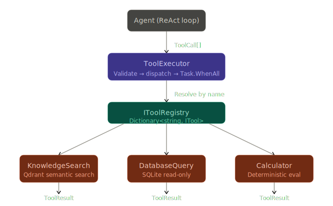

# LocalMind

> **Work in progress**

Local **RAG + ReAct agent** stack: [Ollama](https://ollama.com/) for chat and embeddings, [Qdrant](https://qdrant.tech/) for vector search, optional **SQLite** tooling for structured queries, and a **.NET** agent loop (tool calls, structured JSON answers, tracing). A **semantic cache** hook exists in the agent but is not implemented yet (no hits until you add storage and embeddings).

## Prerequisites

- [.NET 10 SDK](https://dotnet.microsoft.com/download)
- [Ollama](https://ollama.com/) running locally (default `http://localhost:11434`)
- [Docker](https://docs.docker.com/get-docker/) (for Qdrant via Compose)

Pull models you plan to use, for example:

```bash
ollama pull qwen3
ollama pull nomic-embed-text
```

Use a chat model that supports **tools** (see `ollama show <model> --modelfile`).

## Quick start

**1. Start Qdrant**

```bash
docker compose up -d
```

Compose maps **REST** to [http://localhost:6333](http://localhost:6333) and **gRPC** to port **6334**. The Qdrant .NET client uses gRPC, so `appsettings.json` should use port `6334` (see the sample configs under each app).

**2. Build the solution**

```bash
dotnet build LocalMind.sln
```

**3. Ingest a document** (creates the collection if needed, then chunks and embeds)

```bash
dotnet run --project src/LocalMind.IngestConsoleApp/LocalMind.IngestConsoleApp.csproj -- -d /path/to/your.md
```

Configuration is loaded from `src/LocalMind.IngestConsoleApp/appsettings.json` (`DocumentIngest`, `Ollama`, `Qdrant`).

**4. Run the knowledge chat console**

```bash
dotnet run --project src/LocalMind.KnowledgeChatBot/LocalMind.KnowledgeChatBot.csproj
```

Type questions at the prompt; use `exit` or `quit` to leave. Ensure the chat model in `Agent:ModelName` matches a pulled Ollama tag (for example `qwen3:8b`), and that the Qdrant collection name matches what you used at ingest time (default `knowledge`).

## Solution layout

| Project | Role |
|--------|------|
| **LocalMind.KnowledgeChatBot** | Console host: Serilog, agent, knowledge search tool, Ollama + Qdrant |
| **LocalMind.IngestConsoleApp** | CLI to ingest a single file into Qdrant (chunk + embed + upsert) |
| **LocalMind.Agent** | ReAct loop, structured JSON output parsing, traces, conversation store, semantic cache stub |
| **LocalMind.Tools** | Tool registry, executor, manifests (`search_knowledge_base`, calculator, database stub, …) |
| **LocalMind.Ingestion** | Document chunking, embedding via Ollama, Qdrant upsert; `DocumentIngestOptions` |
| **LocalMind.Ollama** | `OllamaApiClient` + `OllamaApiClientOptions` DI |
| **LocalMind.Qdrant** | `QdrantClient` + `QdrantClientOptions` DI |

## Flow diagrams

### ReAct loop



### Tool executor dispatch



## Configuration

Each executable has its own `appsettings.json`. Common sections:

**Agent** (`AgentOptions` — see `src/LocalMind.KnowledgeChatBot/appsettings.json`):

```json
{
  "Agent": {
    "ModelName": "qwen3:8b",
    "MaxIterations": 8,
    "MaxOutputRetries": 3,
    "SemanticCacheThreshold": 0.92,
    "EnableSemanticCache": false,
    "MaxConversationTurns": 20
  }
}
```

Register in DI with `services.AddAgent(configuration)` (see `AgentServiceExtensions`).

**Document ingest** (`DocumentIngestOptions`):

```json
{
  "DocumentIngest": {
    "CollectionName": "knowledge",
    "EmbeddingModel": "nomic-embed-text",
    "EmbeddingDimensions": 768
  }
}
```

The ingest app validates these at startup. The ingester currently uses a fixed embedding model in code for the Ollama call; keep it aligned with `EmbeddingModel` until that is wired through.

**Ollama** (`OllamaApiClientOptions`) and **Qdrant** (`QdrantClientOptions`): host, port, API key, timeouts — see sample `appsettings.json` files in each project.

### Options packages (class libraries)

If you call `Configure<T>(IConfiguration)` or `OptionsBuilder.Bind(IConfiguration)` from a library project, reference **`Microsoft.Extensions.Options.ConfigurationExtensions`**. To enforce **`[Required]`** / **`[Range]`** at startup, add **`Microsoft.Extensions.Options.DataAnnotations`** and use `.ValidateDataAnnotations().ValidateOnStart()` on the options builder (the ingest project does this for `DocumentIngestOptions`).

## Docker Compose

`docker-compose.yml` runs **Qdrant** with a persistent volume. Optional **TimescaleDB** / **pgAdmin** blocks are commented out for later use.
