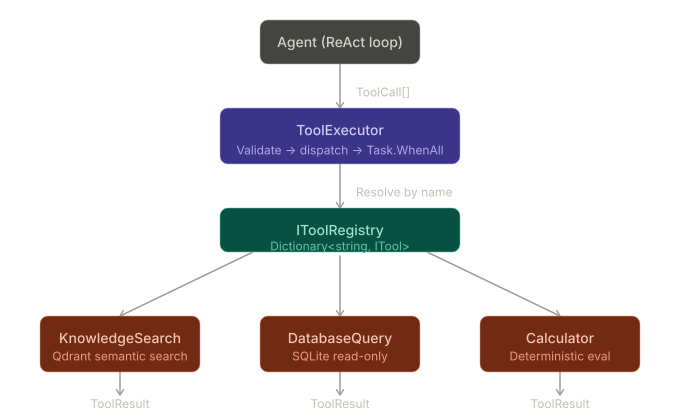

# LocalMind

> **Work in progress**

Local **RAG + ReAct agent** stack: [Ollama](https://ollama.com/) for chat and embeddings, [Qdrant](https://qdrant.tech/) for vector search, optional **SQLite** tooling for structured queries, and a **.NET** agent loop (tool calls, structured JSON answers, tracing). A **semantic cache** stores successful `AgentResponse` payloads in a dedicated Qdrant collection keyed by embedding similarity (optional, on by default). Before lookup and upsert, an **entity extractor** pulls named entities from the query via a small Ollama generate call; those strings are stored on each point and used as a Qdrant payload filter so similar embeddings from unrelated topics are less likely to match. A **query rewriter** expands follow-up questions using recent turns so cache lookup uses a self-contained query.

## Prerequisites

- [.NET 10 SDK](https://dotnet.microsoft.com/download)
- [Ollama](https://ollama.com/) running locally (default `http://localhost:11434`)
- [Docker](https://docs.docker.com/get-docker/) (for Qdrant via Compose)

Pull models you plan to use, for example:

```bash
ollama pull qwen3
ollama pull nomic-embed-text
```

Use a chat model that supports **tools** (see `ollama show <model> --modelfile`).

## Quick start

**1. Start Qdrant**

```bash
docker compose up -d
```

Compose maps **REST** to [http://localhost:6333](http://localhost:6333) and **gRPC** to port **6334**. The Qdrant .NET client uses gRPC, so `appsettings.json` should use port `6334` (see the sample configs under each app).

**2. Build the solution**

```bash
dotnet build LocalMind.sln
```

**3. Ingest a document** (creates the collection if needed, then chunks and embeds)

```bash
dotnet run --project src/LocalMind.IngestConsoleApp/LocalMind.IngestConsoleApp.csproj -- -d /path/to/your.md
```

Configuration is loaded from `src/LocalMind.IngestConsoleApp/appsettings.json` (`Serilog`, `KnowledgeBase`, `DocumentIngest`, `Ollama`, `Qdrant`).

**4. Run the API** (production application boundary)

```bash
dotnet run --project src/LocalMind.Api/LocalMind.Api.csproj
```

Listens on [http://localhost:5080](http://localhost:5080). Endpoints:

| Method | Path | Role |
|--------|------|------|
| `POST` | `/api/chat` | Chat against the knowledge agent |
| `POST` | `/api/agents/{agent}/invoke` | Invoke a named agent (`knowledge`) |
| `GET`  | `/api/conversations/{id}` | Load a conversation |
| `POST` | `/api/knowledge/documents` | Ingest a document (JSON or multipart file) |

HTTP handlers stay thin: they bind a request DTO, call an application service (`IChatService`, `IAgentInvokeService`, `IConversationService`, `IKnowledgeDocumentService`), and return the result. Agent logic stays in `LocalMind.Agent`.

You can also ingest through the API instead of the ingest console:

```bash
curl -X POST http://localhost:5080/api/knowledge/documents \
  -H 'Content-Type: application/json' \
  -d '{"fileName":"notes.md","content":"# Notes\n..."}'
```

**5. Run the knowledge chat CLI** (local development host)

```bash
# In-process local host (default) — same application services as the API, no HTTP
dotnet run --project src/LocalMind.KnowledgeChatBot/LocalMind.KnowledgeChatBot.csproj

# CLI client against a running LocalMind.Api
dotnet run --project src/LocalMind.KnowledgeChatBot/LocalMind.KnowledgeChatBot.csproj -- --api
```

`--api` posts to `POST /api/chat` using `Api:BaseUrl` (default `http://localhost:5080`). Type questions at the prompt; use `exit` or `quit` to leave. Ensure the chat model in `Agent:ModelName` matches a pulled Ollama tag (for example `qwen3:8b`), and that the Qdrant **knowledge** collection name matches what you used at ingest time (default `knowledge`). The semantic cache uses a separate collection (default `semantic_cache`); align `SemanticCache` options with your embedding model and vector width.

## Solution layout

| Project | Role |
|--------|------|
| **LocalMind.Api** | Production HTTP host (Minimal APIs). Thin endpoints → application services → agent |
| **LocalMind.Application** | AI application services: `IChatService`, agent invoke, conversations, document ingest; `AddLocalMindApplication` composition |
| **LocalMind.KnowledgeChatBot** | Local development host / CLI client: in-process REPL by default, or `--api` against LocalMind.Api |
| **LocalMind.IngestConsoleApp** | CLI to ingest a single file into Qdrant (chunk + embed + upsert) |
| **LocalMind.Agent** | ReAct loop, structured JSON output parsing, traces, conversation store, query rewriter, semantic cache integration |
| **LocalMind.Prompts** | Prompt catalog (`IPromptProvider`). Files live under `prompts/{name}/vN.txt` (e.g. `knowledge-agent/v1.txt`); omit version to load the highest `vN` |
| **LocalMind.Cache** | `SemanticCache<T>`, `EntityExtractor` (named entities → Qdrant payload + search filter), options, `AddSemanticCacheOptions`, hosted initializer (ensure Qdrant collection) |
| **LocalMind.Tools** | Tool registry, executor, manifests (`search_knowledge_base`, `calculate`, `query_database` stub, …) |
| **LocalMind.Ingestion** | Document chunking, embedding via Ollama, Qdrant upsert; `KnowledgeBaseOptions` + `DocumentIngestOptions` |
| **LocalMind.Ollama** | `OllamaApiClient` + `OllamaApiClientOptions` DI |
| **LocalMind.Qdrant** | `QdrantClient` + `QdrantClientOptions` DI |
| **LocalMind.Telemetry** | Prometheus metric server hosted service + agent LLM call metrics |

## Flow diagrams

### ReAct loop



### Tool executor dispatch



## Configuration

Each executable has its own `appsettings.json`. Common sections:

**Agent** (`AgentOptions` — see `src/LocalMind.Api/appsettings.json`):

```json
{
  "Agent": {
    "ModelName": "qwen3:8b",
    "MaxIterations": 8,
    "MaxOutputRetries": 3,
    "MaxConversationTurns": 20
  }
}
```

Register in DI with `services.AddAgent(configuration)` in `src/LocalMind.Agent/AgentExtensions.cs`. Hosts call `AddLocalMindApplication` in `src/LocalMind.Application/DependencyInjection.cs`, which wires the agent, tools, cache, ingest, and application services. Keys omitted from JSON use defaults from `AgentOptions` (for example `MaxConversationTurns` defaults to `20`).

**Metrics** (`PrometheusMetricServerOptions` — API host registers `AddPrometheusMetricServer`):

```json
{
  "Metrics": {
    "Port": 9091
  }
}
```

Metrics are exposed from the API process and scraped by Prometheus. Current agent metrics:

- `localmind_agent_llm_calls_total` (labels: `model`, `cache_hit`)
- `localmind_agent_llm_tokens_total` (labels: `model`, `token_type`)
- `localmind_agent_llm_duration_ms` (labels: `model`, `cache_hit`)
- `localmind_agent_llm_tool_calls_requested` (label: `model`)
- `localmind_agent_llm_iteration` (label: `model`)

**Semantic cache** (`SemanticCacheOptions` — registered by `AddLocalMindApplication`):

```json
{
  "SemanticCache": {
    "Enabled": true,
    "CollectionName": "semantic_cache",
    "EmbeddingModel": "nomic-embed-text",
    "VectorSize": 768,
    "SimilarityThreshold": 0.92
  }
}
```

When enabled, the agent embeds the (rewritten) user query, extracts entities (see **Entity extractor** below), and searches this collection above `SimilarityThreshold`. If the query yields at least one entity, the search applies a Qdrant filter requiring every extracted entity to appear in the cached point’s `entities` payload field (AND semantics). On a miss, the final structured response is upserted with the same embedding, query text, and entity list. The collection is created on startup if missing (same vector size and distance as configured here).

**Entity extractor** (`EntityExtractorOptions` — registered by `AddSemanticCacheOptions` in `src/LocalMind.Cache/SemanticCacheExtensions.cs`):

```json
{
  "EntityExtractor": {
    "Model": "qwen3:8b"
  }
}
```

The model must be pulled in Ollama. It runs a non-streaming `Generate` call with a short prompt that asks for a JSON array of strings only. `SemanticCache<T>` receives `EntityExtractor` via DI; `AddAgent` wires the cache with the same extractor instance the options register. If you omit the **`EntityExtractor`** block from JSON, the default model name from `EntityExtractorOptions` applies.

**Query rewriter** (`QueryRewriterOptions` — bound in `AddAgent`):

```json
{
  "QueryRewriter": {
    "Model": "qwen3:8b"
  }
}
```

Used before the cache lookup when there is conversation history: the model rewrites the user message into a standalone question so pronouns and ellipses still match sensible cache keys.

**Knowledge base / vector index** (`KnowledgeBaseOptions` — used by ingest and `search_knowledge_base`):

```json
{
  "KnowledgeBase": {
    "CollectionName": "knowledge",
    "EmbeddingModel": "nomic-embed-text",
    "VectorSize": 768
  }
}
```

**Document ingest** (`DocumentIngestOptions` — API document ingest and ingest console; chunking plus batch sizes for embed/upsert):

```json
{
  "DocumentIngest": {
    "ChunkSize": 2000,
    "Overlap": 300,
    "EmbeddingBatchSize": 16,
    "UpsertBatchSize": 32
  }
}
```

The API and in-process chat host bind **`KnowledgeBase`**, **`DocumentIngest`**, **`SemanticCache`**, and **`EntityExtractor`** options (via `AddLocalMindApplication`); the ingest app binds **`KnowledgeBase`** and **`DocumentIngest`**. `EmbeddingModel` and `VectorSize` define the index contract for the knowledge collection (ingest and search must agree). The semantic cache uses the **`SemanticCache`** section’s model and dimensions for its own collection.

**Ollama** (`OllamaApiClientOptions`) and **Qdrant** (`QdrantClientOptions`): host, port, API key, timeouts — see sample `appsettings.json` files in each project.

### Options packages (class libraries)

If you call `Configure<T>(IConfiguration)` or `OptionsBuilder.Bind(IConfiguration)` from a library project, reference **`Microsoft.Extensions.Options.ConfigurationExtensions`**. To enforce **`[Required]`** / **`[Range]`** at startup, add **`Microsoft.Extensions.Options.DataAnnotations`** and use `.ValidateDataAnnotations().ValidateOnStart()` on the options builder (the ingest project does this for `KnowledgeBaseOptions` and `DocumentIngestOptions`).

## Docker Compose

`docker-compose.yml` runs **Qdrant**, **Prometheus**, **Loki**, and **Grafana** with persistent volumes where configured. Optional **TimescaleDB** / **pgAdmin** blocks are commented out for later use.

For metrics, `prometheus.yml` includes:

- Scrape job: `localmind-api`
- Target: `host.docker.internal:9091`

Grafana dashboard JSON for the agent metrics is available at `localmind-agent-metrics-dashboard.json`.
Import it via **Dashboards → New → Import** and select the `Prometheus` datasource.
